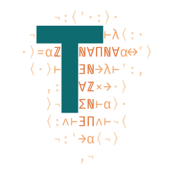

<p align="center">
  
</p>

<h1 align="center">liaison</h1>

<p align="center">
  <em>A delegation broker in Lean 4: verify a warrant, hold the credit, make one call, record it — with the authority and spend checks carried in the types.</em>
</p>

<p align="center">
  <a href="https://github.com/typednotes/liaison/actions/workflows/lean_action_ci.yml"></a>
  <a href="https://github.com/typednotes/liaison/actions/workflows/docker-publish.yml"></a>
  <a href="https://github.com/typednotes/liaison/pkgs/container/liaison"></a>
  <a href="https://github.com/typednotes/liaison/tags"></a>
  <a href="https://lean-lang.org/"></a>
  <a href="https://github.com/typednotes/linen"></a>
  <a href="LICENSE"></a>
</p>

---

`liaison` is the single egress chokepoint through which delegated work reaches
third-party providers. Each request carries a macaroon-style **warrant**;
liaison verifies it, places a **credit hold**, makes (or refuses) exactly
**one outbound call** with the stored credential, and **records the attempt**.
It implements the service described in
[`typednotes/typednotes`](https://github.com/typednotes/typednotes)'s
`docs/services/broker.md` and `docs/services/ledger.md`, and is built on
[`linen`](https://github.com/typednotes/linen).

> Lean makes the authority and the hold lifecycle correct. Postgres makes the
> spend concurrency correct. HMAC makes the warrant unforgeable.

## Table of contents

- [Features](#features)
- [Role](#role)
- [Guarantees](#guarantees)
- [How a call flows](#how-a-call-flows)
- [Quick start](#quick-start)
- [Configuration](#configuration)
- [HTTP API](#http-api)
- [Lean clients](#lean-clients)
- [Credentials](#credentials)
- [Database schema](#database-schema)
- [Docker](#docker)
- [Project status](#project-status)
- [License](#license)

## Features

- **Warrants** — HMAC-SHA256 tag chains with attenuating caveats (provider,
  action, resource, run, expiry, budget); the tag is verified before any
  caveat is trusted.
- **Credit holds** — an atomic conditional insert against `ledger`'s
  `credit_holds`/`credit_ledger`, settled or released around the call.
- **Typed credentials** — `bearer`, `header`, Google/Dropbox/GitLab OAuth
  (with refresh and vault write-back), AWS S3 (SigV4) and Azure SAS, fetched
  from [`typednotes/secrets`](https://github.com/typednotes/secrets).
- **Request confinement** — URLs pinned to the credential's `base_url`,
  sensitive and framing headers refused, SAS parameters reserved.
- **Audit** — every attempt, allowed or refused, writes exactly one
  `audit_log` row.
- **A pure wire module** — `Liaison.Wire` is both the format the server parses
  and the Lean SDK clients import, without linking any HMAC, Postgres or
  egress code.
- **Proofs where they fit** — `Warrant.attenuate_monotone`,
  `Request.ofWarrant_unique` and `Denial.ofCode?_code` are Lean theorems,
  checked by the kernel on every build; the rest of the invariants are held
  by private constructors, single Postgres statements or pinned tests (see
  [Guarantees](#guarantees)).

## Role

In `typednotes`, delegated work (an agent run, a tool, a sub-tool) never holds
a provider credential and never talks to a provider directly. It holds a
**warrant** — a bearer token that says *what* it may do (provider, action,
resource), *for which run*, *until when*, and *up to what cost* — and asks
`liaison` to make the call on its behalf. `liaison` is therefore the one place
where three things meet:

| | Owned by | `liaison`'s part |
|---|---|---|
| **Authority** — may this caller do this? | the app, which mints warrants | verifies the HMAC chain against `LIAISON_ROOT_KEY`, then checks every caveat against the exact request |
| **Spend** — can the org afford it? | [`ledger`](https://github.com/typednotes/ledger), which owns `credit_ledger`/`credit_holds` | places, settles and releases the hold on the request path, directly in Postgres |
| **Credentials** — how do we authenticate upstream? | [`secrets`](https://github.com/typednotes/secrets), the vault | fetches, refreshes and writes back the credential; the caller never sees it |

### The division of labour with `ledger`

`ledger` is the record of what an org may spend, what is reserved and what
was spent; `liaison` is the component that *spends*. They share tables, not
an API:

1. **Reserve** — before any outbound call, `liaison` inserts a `held` row in
   `credit_holds` for the request's cost, *only if* `balance − held ≥ cost`
   (one conditional `insert … select … where`, the statement `ledger` defines
   in `Ledger/Sql/Reserve.lean`). No row, no call: the request is refused
   with `budget_unavailable`.
2. **Settle** — on success, in one transaction, the hold becomes `settled`
   and a negative `usage` row is appended to `credit_ledger`.
3. **Release** — on a refusal or an exception after the hold was placed, the
   hold becomes `released` and nothing is charged.
4. **Expire** — if `liaison` dies mid-call, the hold's 15-minute
   `expires_at` passes and `ledger`'s sweeper releases it. A crash can delay
   credit, never lose it.

`ledger` owns the schema and its migrations; `liaison` owns only `audit_log`.
`liaison` never migrates either: `typednotes-infra` applies `ledger`'s history
before `liaison`'s (see [Database schema](#database-schema)).

## Guarantees

Each guarantee is held by one named mechanism: a **Lean type or theorem**
(checked by the kernel when the library builds), **HMAC** (checked on every
request), a **single Postgres statement** (checked by the database at run
time), or a **pinned test**.

| Guarantee | Held by | Where |
|---|---|---|
| No outbound call without a warrant whose tag verified *and* whose caveats permit that exact request | types: `Authorized r` has a private constructor; the only route in is `authorize`, which checks the tag (`VerifiedTag w`) before reading any caveat, and stores the proof `w.permits r` | [`Liaison/Auth.lean`](Liaison/Auth.lean) |
| No outbound call without a live credit hold | types: `Reserved r` has a private constructor; the only route in is `withReservation`, and `callProvider`/`callInference` require one | [`Liaison/Budget.lean`](Liaison/Budget.lean), [`Liaison/Egress/Provider.lean`](Liaison/Egress/Provider.lean) |
| Attenuating a warrant can only narrow it, never widen it | theorem `Warrant.attenuate_monotone` | [`Liaison/Warrant/Core.lean`](Liaison/Warrant/Core.lean) |
| A warrant cannot be forged, have its caveats altered, or be moved to another org without the root key | HMAC-SHA256 chain over every caveat; `orgId` folded into the first link (`s₀ = HMAC(key, id ⧺ orgId)`); tag, spliced-caveat and org-swap tampering pinned in `TagTest` | [`Liaison/Warrant/Tag.lean`](Liaison/Warrant/Tag.lean) |
| The root key comes from the environment, never from code | types: `RootKey` has a private constructor; the only route in is `RootKey.fromEnv` | [`Liaison/Warrant/Tag.lean`](Liaison/Warrant/Tag.lean) |
| A client's request cannot disagree with its warrant | theorem `Request.ofWarrant_unique` | [`Liaison/Wire.lean`](Liaison/Wire.lean) |
| A client can decode every refusal code liaison sends | theorem `Denial.ofCode?_code` | [`Liaison/Warrant/Caveat.lean`](Liaison/Warrant/Caveat.lean) |
| **A hold is placed only if the org's balance covers it** — ⚠ *only under `SERIALIZABLE`*, see below | Postgres: one conditional `insert … select … where balance − held ≥ amount`, no read-then-write in application code | [`Liaison/Budget.lean`](Liaison/Budget.lean) |
| Every hold is settled or released, including when the call throws | code: `withReservation` brackets the callback (`try`/`catch`, release on any exception); a crash is covered by `expires_at` and `ledger`'s sweeper | [`Liaison/Budget.lean`](Liaison/Budget.lean) |
| A hold leaves `held` at most once, and never comes back | Postgres: every transition is `update … where state = 'held'` | [`Liaison/Budget.lean`](Liaison/Budget.lean) |
| A settled hold and its usage row commit together or not at all | Postgres: the state change and the `credit_ledger` insert are one transaction | [`Liaison/Budget.lean`](Liaison/Budget.lean) |
| The credential never reaches the caller, and cannot be pointed elsewhere | code: auth/framing headers refused (`header_denied`), URL confined to the credential's `base_url` (`url_denied`); credentials have no `Repr`/`ToString` | [`Liaison/Egress/Policy.lean`](Liaison/Egress/Policy.lean), [`Liaison/Egress/Credential.lean`](Liaison/Egress/Credential.lean) |
| Every attempt, allowed or refused, writes exactly one audit row, or the request fails loudly | code: one call site per outcome in `handleEgress`; `recordAttempt` throws rather than drop a row | [`Liaison/Server.lean`](Liaison/Server.lean), [`Liaison/Audit.lean`](Liaison/Audit.lean) |
| liaison issues exactly the SQL `ledger` and the schema expect | test: every statement's text is pinned | [`LiaisonTest/Liaison/BudgetTest.lean`](LiaisonTest/Liaison/BudgetTest.lean), [`AuditTest.lean`](LiaisonTest/Liaison/AuditTest.lean) |
| The wire format does not drift | test: the literal body is pinned (`golden`), plus `decode ∘ encode` | [`LiaisonTest/Liaison/WireTest.lean`](LiaisonTest/Liaison/WireTest.lean) |

> **⚠ Known gap — the reserve race** (shared with `ledger`). A single
> statement is atomic but not isolated from a concurrent one: under
> Postgres's default `READ COMMITTED`, two concurrent reserves for the same
> org each evaluate `balance − held` without the other's uncommitted hold, so
> both can succeed and together overspend. `liaison` does not set the
> isolation level. The fix (e.g. a per-org `pg_advisory_xact_lock`) changes a
> contract shared with `ledger` and is tracked there.

What is **not** claimed:

- **No Lean theorem states no-double-spend.** Lean cannot see two containers;
  that is the reserve statement's job, with the caveat above.
- **The tag comparison is not constant-time** (plain `==`, as in `linen`'s
  JOSE verifier); see [`TODO.md`](TODO.md).
- **Expiry is checked against the caller's `now`**, not liaison's clock.
- **Cost is declared, not metered**: a provider call is charged the request's
  full `cost` (capped by the warrant's `budget` caveat). `actual ≤ hold` is
  not re-checked at settlement.
- **A database outage looks like an empty budget**: both are
  `budget_unavailable`.
- **The SQL is pinned, not executed** by the test suite, and no live vault,
  OAuth or S3 round trip runs in CI. Warrant revocation is not implemented.

The full list of named gaps is in [`AGENTS.md`](AGENTS.md).

## How a call flows

```
caller ──POST /v0/egress──▶ liaison
                              1. decode           Liaison.Wire      → malformed_warrant
                              2. authorize        HMAC, caveats     → tag_invalid, expired, …
                              3. pre-check        account, headers  → malformed_warrant, header_denied
                              4. reserve  ───────▶ credit_holds     → budget_unavailable
                              5. credential ─────▶ secrets (+ OAuth refresh) → credential_unavailable (hold released)
                              6. policy           URL, headers      → url_denied, header_denied  (hold released)
                              7. one call ───────▶ provider         → upstream_failed            (hold released)
                              8. settle  ────────▶ credit_holds + credit_ledger
                              9. audit   ────────▶ audit_log         (every path, exactly once)
caller ◀── 200 {status, headers, body} or {error} ─┘
```

## Quick start

### Build

```sh
lake build            # the Liaison library and the `liaison` executable
```

Requires the Lean toolchain in [`lean-toolchain`](lean-toolchain) (via
[elan](https://github.com/leanprover/elan)), plus `libpq`, `pkg-config` and
OpenSSL headers for `linen`'s native code (`brew install libpq pkg-config
openssl` on macOS; on Debian/Ubuntu, the `apt-get` line in
[`Dockerfile`](Dockerfile)).

### Test

```sh
LIAISON_ROOT_KEY=$(openssl rand -hex 32) lake test
```

### Run

```sh
LIAISON_ROOT_KEY=... DATABASE_URL=... SECRETS_HOST=... \
  SECRETS_USERNAME=liaison SECRETS_PASSWORD=... \
  GOOGLE_CLIENT_ID=... GOOGLE_CLIENT_SECRET=... \
  DROPBOX_CLIENT_ID=... DROPBOX_CLIENT_SECRET=... \
  GITLAB_CLIENT_ID=... GITLAB_CLIENT_SECRET=... \
  lake exe liaison
```

## Configuration

| Variable | Required | Notes |
|---|---|---|
| `LIAISON_ROOT_KEY` | yes | hex root key the warrant tag chain is verified with |
| `DATABASE_URL` | yes | Postgres URI (`audit_log`, `ledger`'s `credit_holds`/`credit_ledger`) |
| `SECRETS_HOST` | yes | `typednotes/secrets` host |
| `SECRETS_PORT` | no | default `443` (`80` with `SECRETS_INSECURE=1`) |
| `SECRETS_INSECURE` | no | `1` disables TLS to `secrets` (local dev only) |
| `SECRETS_USERNAME`, `SECRETS_PASSWORD` | one of these… | `userpass` login (`POST /v1/auth/userpass/login`); the token is cached and renewed when < 60 s remain, and once after a `403` |
| `SECRETS_TOKEN` | …or this | static vault token, used only when `SECRETS_USERNAME` is unset. Startup fails if neither is configured |
| `GOOGLE_CLIENT_ID`, `GOOGLE_CLIENT_SECRET` | no | needed to refresh `google_oauth` credentials; without them a due refresh is `credential_unavailable` |
| `DROPBOX_CLIENT_ID`, `DROPBOX_CLIENT_SECRET` | no | the same, for `dropbox_oauth` (the app's Dropbox app) |
| `GITLAB_CLIENT_ID`, `GITLAB_CLIENT_SECRET` | no | the same, for `gitlab_oauth` (the app's gitlab.com OAuth application) |
| `LIAISON_PORT` | no | default `8080` |

## HTTP API

- `GET /_health` → `200 ok` (liveness only).
- `POST /v0/egress` — the one egress chokepoint. The wire format is
  [`Liaison/Wire.lean`](Liaison/Wire.lean), which Lean clients import (see
  [Lean clients](#lean-clients)); the cross-service contract is
  `typednotes/typednotes`'s `docs/connections.md` §5. The `call` object:

```jsonc
"call": {
  "kind": "provider",
  "account": "{user_id}/{connection_id}",   // last segment must equal "resource"
  "method": "GET",                          // uppercase letters only
  "url": "https://api.github.com/user",     // base_url, base_url/…, or base_url?…
  "headers": {"accept": "application/json"},  // optional, string → string
  "body": "…"                               // optional, UTF-8 text
}
```

On success the response is `200` with `{"status", "headers", "body": <hex>}`
relaying whatever the provider answered. Every attempt writes exactly one
`audit_log` row whose `outcome` is `ok` or the denial's `error` code:

| `error` | HTTP | When |
|---|---|---|
| `malformed_warrant` | 400 | unparsable body (including a `u64` field outside `[0, 2^64)`), bad `method`, `account` not `a/b` of `[A-Za-z0-9_-]` or its last segment ≠ `resource` |
| `tag_invalid`, `capability_denied`, `resource_denied`, `wrong_run`, `expired`, `budget_exceeded` | 403 | warrant checks |
| `budget_unavailable` | 402 | no hold could be placed (or the hold lifecycle's Postgres calls failed) |
| `header_denied` | 400 | a caller header is `authorization`, `proxy-authorization`, `x-api-key`, `host`, `content-length`, `cookie`, `transfer-encoding`, `connection`, any `x-amz-*`, a header the credential sets, or malformed |
| `url_denied` | 403 | URL not `base_url`, under `base_url + "/"`, or `base_url + "?"`; or unparsable, with userinfo, a fragment or a dot segment; or, for `azure_sas`, a query key that is a SAS parameter |
| `credential_unavailable` | 502 | no credential, unknown `kind`, malformed credential, vault failure, OAuth refresh failed/impossible |
| `upstream_failed` | 502 | the provider could not be reached |
| `inference_not_implemented` | 501 | `{"kind": "inference"}` (stub) |

## Lean clients

`Liaison.Wire` is the format the server parses, and the module a Lean client
imports to speak it (pure; it links none of liaison's HMAC, Postgres or egress
code):

```lean
require liaison from git "https://github.com/typednotes/liaison" @ "v0.5.5"
```

```lean
import Liaison.Wire
open Liaison.Wire

-- `warrant ← decodeWarrant v` (v : Data.Json.Value, as the app handed it out), then per call:
let body ← Body.provider warrant now 0
  { account := "{user_id}/{connection_id}", method := "GET", url := "https://api.github.com/user" }
-- POST body.encode to /v0/egress, then:
match ← decodeReply httpStatus responseText with
| .relayed r => … r.status, r.header? "location", r.body …
| .refused status code => … Liaison.Denial.ofCode? code …
```

`Body.provider` reads provider, action, resource, run and org off the
warrant's caveats (`Request.ofWarrant`), so the request cannot disagree with
the warrant, and refuses an `account` that does not name the warrant's
resource.

## Credentials

Read from `secret/data/thirdparty/{provider}/{account}`; the `data` object is
one of (every value a JSON string; optional `headers`: static headers added to
every call):

| `kind` | Fields | Authentication |
|---|---|---|
| `bearer` | `base_url`, `token` | `Authorization: Bearer {token}` |
| `header` | `base_url`, `header`, `token` | `{header}: {token}` |
| `google_oauth` | `base_url`, `access_token`, `refresh_token`, `expires_at` (Unix s) | `Authorization: Bearer {access_token}`; refreshed at `https://oauth2.googleapis.com/token` when `expires_at - 60 ≤ now` (liaison's wall clock), then written back to the vault (best-effort) |
| `dropbox_oauth` | as `google_oauth` | the same, refreshed at `https://api.dropboxapi.com/oauth2/token` |
| `gitlab_oauth` | as `google_oauth` | the same, refreshed at `https://gitlab.com/oauth/token`; GitLab rotates the refresh token on every refresh, so a failed write-back means reconnecting |
| `s3` | `base_url`, `region`, `access_key_id`, `secret_access_key` | AWS SigV4, service `s3`, payload hash = SHA-256 of the body, signed headers `host;x-amz-content-sha256;x-amz-date` |
| `azure_sas` | `base_url`, `sas` (a query string of SAS parameters only, with `sv` and `sig`) | the SAS appended to the call's query; the caller's query may not use any SAS parameter name (`url_denied`) |

## Database schema

`liaison` owns one table, `audit_log` ([`sql/0001_audit_log.sql`](sql/0001_audit_log.sql)),
and writes `ledger`'s `credit_holds`/`credit_ledger`. It never migrates at
startup: in production `typednotes-infra` reads `sql/*.sql` at the release tag
and applies it as a declared migration history before the container rolls out
(the container also waits for `ledger`'s history, whose tables it writes). For
a local database, apply the app's, then `ledger`'s, then `sql/*.sql` here, in
that order.

## Docker

Images are published to `ghcr.io/typednotes/liaison` — `edge` from `main`,
and `latest`, `X.Y.Z` and `X.Y` from release tags.

```sh
docker run --rm -p 8080:8080 \
  -e LIAISON_ROOT_KEY=... -e DATABASE_URL=... \
  -e SECRETS_HOST=... -e SECRETS_USERNAME=liaison -e SECRETS_PASSWORD=... \
  ghcr.io/typednotes/liaison:latest
```

To build the image locally:

```sh
docker build -t liaison .
```

## Project status

`liaison` is at **v0**: minimal but real. Deliberately out of scope for now —
rate limiting, circuit breaking, OpenTelemetry, human-in-the-loop policy,
warrant revocation and inference routing (`{"kind": "inference"}` is a loud,
structured-denial stub). See [`AGENTS.md`](AGENTS.md) for the module layout,
the full list of named gaps, and every deliberate deviation from the design
docs.

## License

Licensed under the [Apache License, Version 2.0](LICENSE).
